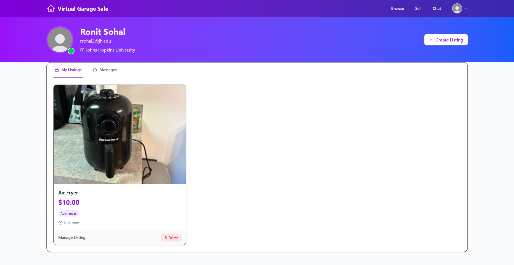
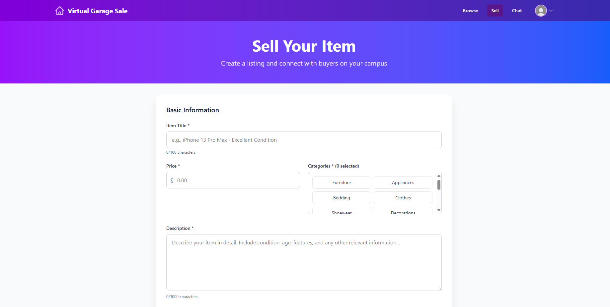
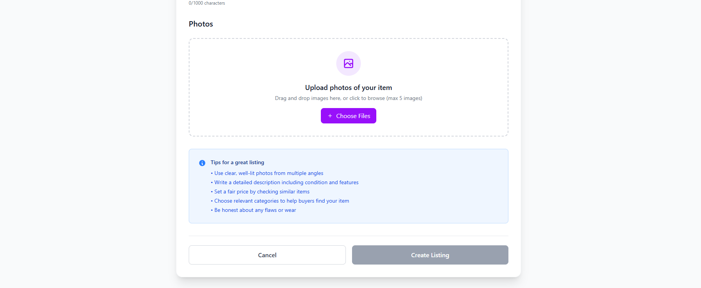
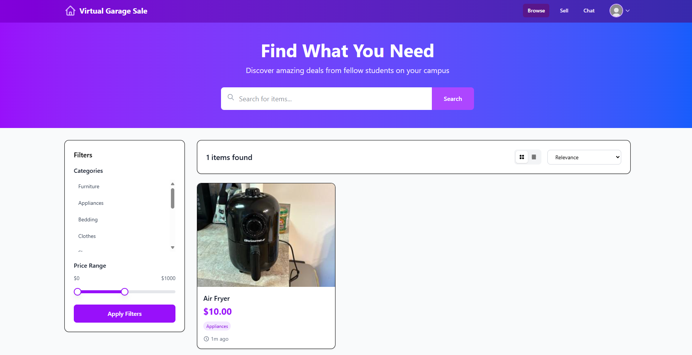
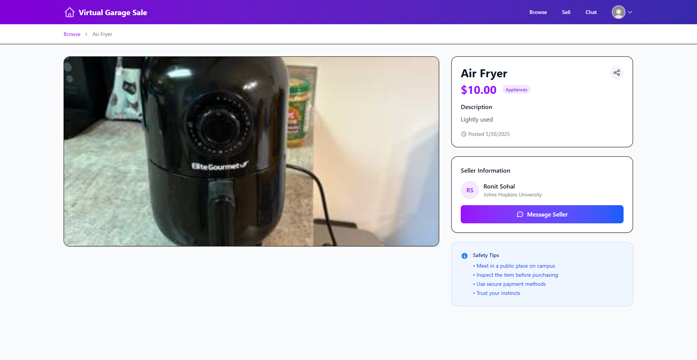
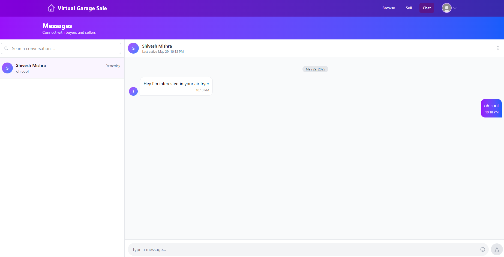

# Virtual Garage Sale (VGS)

A university-specific online marketplace where students can list, browse, and purchase sublets and secondhand items. Built to streamline moving-out processes and connect campus communities.

---

## 📚 Tech Stack

* **Frontend**: React.js, Tailwind CSS
* **Backend**: Spring Boot (Java)
* **Database**: MongoDB
* **File Storage**: AWS S3
* **Authentication**: JSON Web Tokens (JWT) with university email verification
* **Deployment**:

  * Frontend: Netlify or Vercel
  * Backend: AWS ECS/EC2, Heroku, or similar

---

## 🚀 Features

* **User Authentication**: Sign up and log in with a verified university email (.edu)
* **Create & Manage Listings**: Students can create listings with images (stored on S3), edit, and delete
* **Browse & Search**: Filter by category, price, posting time, and relevance
* **Messaging**: Secure in-app messaging between buyers and sellers
* **AI Tagging**: Automatic categorization of items using a simple AI tagger (To be Added)
* **School Isolation**: Listings scoped per university; images organized by school ID on S3

## 📸 Screenshots

### Dashboard

---

### Create Listing Flow

---

### Listing Details & Messaging

---

